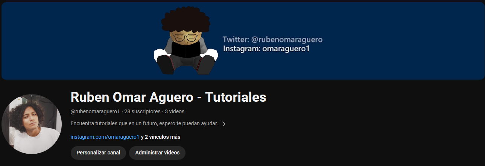

## Hi! Welcome to my github profile, I'm Ruben Omar Aguero!
I am a Mechatronic, graduated from the UTNC here in Mexico. Since I was 16 I feel passionate about the programming world!
Here you will find some of my projects, I mainly use:
- Kotlin
- C++
- Python
- Javascript
- PHP
- C#
---

## These are some of my projects!
- [Random Choice App - Android (PlayStore)](https://play.google.com/store/apps/details?id=com.roa.eleccionaleatoria)
- [News App - Android](https://github.com/omaraguero/news-app-android-kotlin)
- [CSW - Stickers Creator for WhatsApp in Kotlin](https://github.com/omaraguero/stickers-for-whatsapp-kotlin)
- [Attendance System in C# with .NET](https://github.com/omaraguero/attendance-system-csharp)
- [Weather Page with Python-Django](https://github.com/omaraguero/weather-app)
- [Banana Control for Mario64 with Python](https://github.com/omaraguero/Python-Control-de-Platano-para-Mario-Kart-64)
- [PHP-SchoolPage-CRUD](https://github.com/omaraguero/php-CRUD)
- [QR Lector for turning on LEDS in Arduino](https://github.com/omaraguero/lectorQRPosiciones)
- [PetCRUD with C# and .NET](https://github.com/omaraguero/PetCRUD-Csharp_dotNet)
- [GTi File Creator for EMDEP GTI](https://github.com/omaraguero/GTiFileCreator)
- [Go API - MongoDB](https://github.com/omaraguero/go-API)
- [Pizza Shop Page with ASP.NET](https://github.com/omaraguero/Pizza_shop_ASPdotNet)

### And also, I have a YouTube Channel where I upload some of my projects!
- [YouTube Channel](https://www.youtube.com/channel/UC7IlEpwtFkT9YV-qYkEQirQ)

<!--
**omaraguero/omaraguero** is a ✨ _special_ ✨ repository because its `README.md` (this file) appears on your GitHub profile.

Here are some ideas to get you started:

- 🔭 I’m currently working on ...
- 🌱 I’m currently learning ...
- 👯 I’m looking to collaborate on ...
- 🤔 I’m looking for help with ...
- 💬 Ask me about ...
- 📫 How to reach me: ...
- 😄 Pronouns: ...
- ⚡ Fun fact: ...
-->

